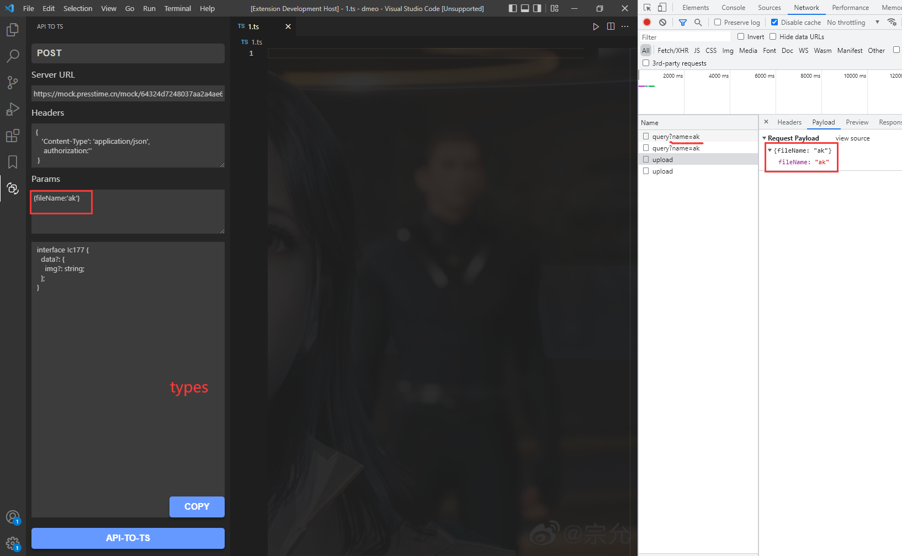

## JS To TS

**功能一:**&nbsp; 将api返回数据转为typescript类型声明

**功能二:** &nbsp;将JavaScript对象转为typescript类型声明

**功能三:** &nbsp;将Swagger文档提供的类型自动转为typescript类型的一款插件

---  

## 用法

## 快捷键配置
- 默认按键配置(window & mac)
1. Object转换操作 `ctrl+shift+j` (功能二)
2. Swagger转换操作 `ctrl+shift+k` (功能三)

- 你也可以去快捷键设置界面进行自定义设置

PS: [File Teleport](https://github.com/AKclown/file-teleport)文件同步更新插件