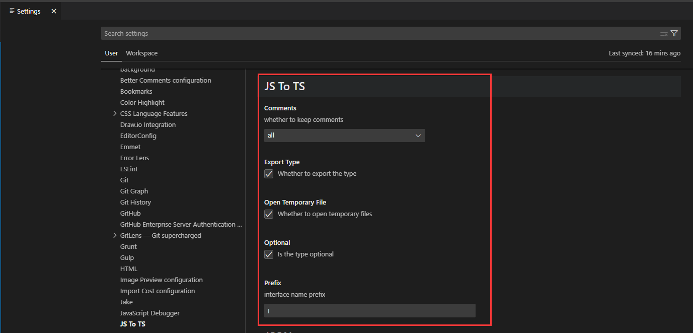

## JS To TS

**功能一:**&nbsp; 将api返回数据转为typescript类型声明  
PS: 自动将类型内容分配到剪贴板  

**功能二:** &nbsp;将JavaScript对象转为typescript类型声明  
PS: 未选择内容时按`ctrl+shift+j`会转换剪切板内容  

**功能三:** &nbsp;将Swagger文档提供的类型自动转为typescript类型的一款插件  

---  

## 设置面板

--- 

## 用法

## 快捷键配置
- 默认按键配置(window & mac[ctrl -> control])
1. Object转换操作 `ctrl+shift+j` (功能二)
2. Swagger转换操作 `ctrl+shift+k` (功能三)
3. 添加块级注释行 `ctrl+'` (功能四 => /**  */)

- 你也可以去快捷键设置界面进行自定义设置

---

PS：如果你觉得此插件对你有帮助，那就别吝啬你手里的'⭐'给[本项目start](https://github.com/AKclown/js-to-ts)，你的鼓励就是对作者最大的支持，如发现bug或者交互改进都可去项目提[issue](https://github.com/AKclown/js-to-ts/issues)