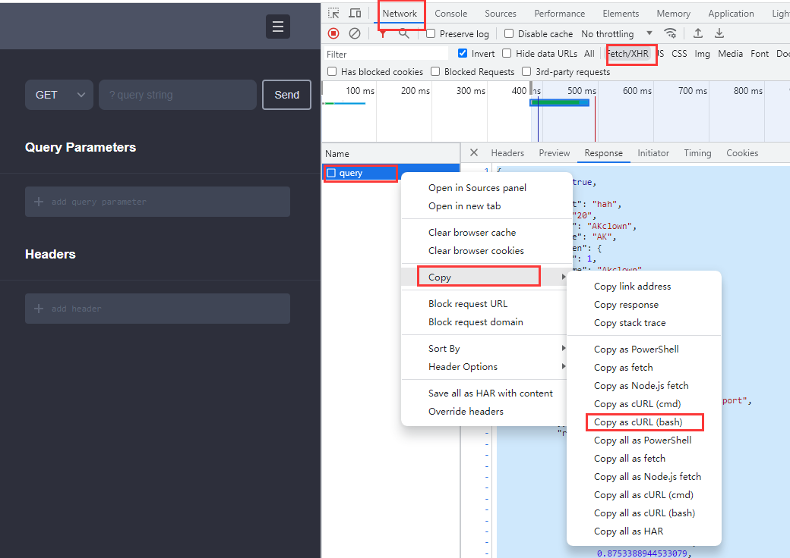

## JS To TS `优化中`

**功能一:**&nbsp; 将`api`返回数据转为`typescript`类型声明  
PS: 自动将类型内容分配到剪贴板  
  
支持`curl`格式的链接请求  
`chrome -> network -> copy -> Copy as cURL(bash)`

**功能二:** &nbsp;将`JavaScript`对象转为`typescript`类型声明  
PS: 未选择内容时按`ctrl+shift+j`会转换剪切板内容  

**功能三:** &nbsp;将`swagger`的`json`数据转换成
`typescript`类型声明     

***提示:*** 生成swagger的JSON文件导航到`http://localhost:3000/api-json`(假设我们的swagger文档地址为`http://localhost:3000/api`)

---

## 设置面板

---

## 用法

## 快捷键配置

- 默认按键配置(window & mac[ctrl -> control])

1. Object 转换操作 `ctrl+shift+j` (功能二)
2. Swagger 转换操作 `ctrl+shift+k` (功能三)
3. 添加块级注释行 `ctrl+'` (功能四 => /\*\* \*/)

- 你也可以去快捷键设置界面进行自定义设置

---

PS：如果你觉得此插件对你有帮助，那就别吝啬你手里的'⭐'给[本项目 start](https://github.com/AKclown/js-to-ts)，你的鼓励就是对作者最大的支持，如发现 bug 或者交互改进都可去项目提[issue](https://github.com/AKclown/js-to-ts/issues)
