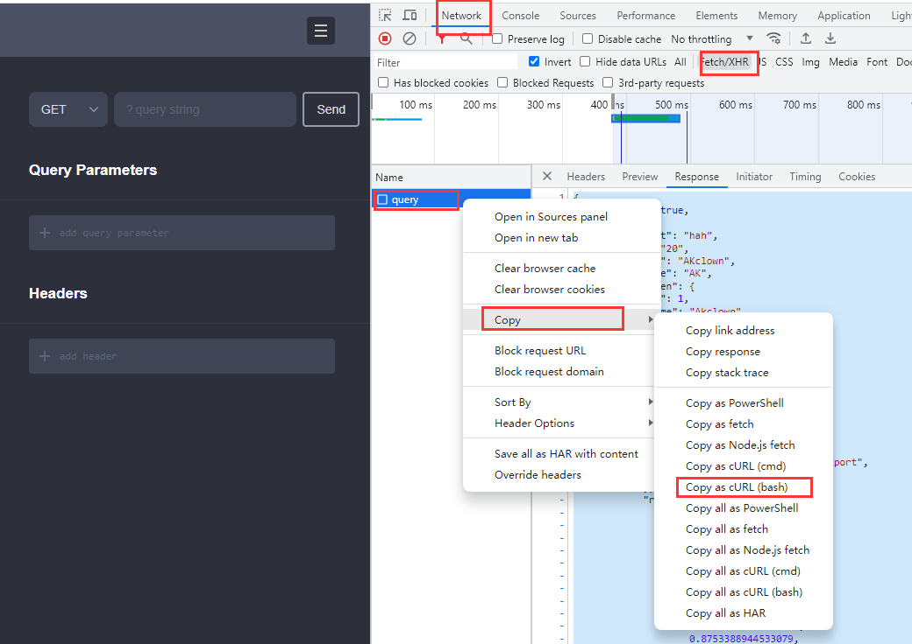

## JS To TS[中文版](./README-ZH.md) `Optimizing`

**Easier and more convenient conversion of ts type declarations**🤡

## Feature

**convert objects of JavaScript to typescript type declaration.**  
PS: Pressing `ctrl+shift+j` when nothing is selected will convert the clipboard content

**a plug-in that converts the type provided by the Swagger document to the typescript type automatically.**  
PS: To generate and download a Swagger JSON file, navigate to `http://localhost:3000/api-json` (assuming that your Swagger documentation is available under `http://localhost:3000/api`).

**Convert API return data to typescript type declaration.**  
Link request to support the `curl` format  
 `chrome -> network -> copy -> Copy as cURL(bash)`  
PS: Automatically assign the type content to the clipboard  

## Settings plane

**Some custom configuration items**

## Keyboard shortcuts configuration.

- Default button configuration (window & mac)

1. Object conversion operation `ctrl+shift+j` (Function 2)
2. Swagger conversion operation `ctrl+shift+k` (Function 3)
3. Add Block Comments `ctrl+'` (Function 4 => /\*\* \*/)

- You can also make customize settings in the shortcut key setting interface.

---

PS: If you think this plug-in is helpful to you, [don't be stingy with the'⭐' in your hand to start the project](https://github.com/AKclown/js-to-ts), your encouragement is biggest support to the author. If you finds bugs or interactive improvements,you can go to the project to [raise issue](https://github.com/AKclown/js-to-ts/issues).
