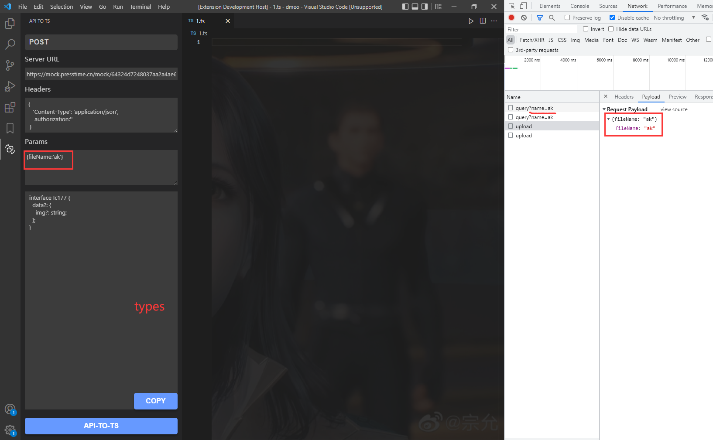

## JS To TS[中文版](./README-ZH.md)

**Function 1:**&nbsp; Convert API return data to typescript type declaration.  
PS: Automatically assign the type content to the clipboard

**Function 2:**&nbsp; convert objects of JavaScript to typescript type declaration.

**Function 3:**&nbsp; a plug-in that converts the type provided by the Swagger document to the typescript type automatically.

## usage

## Keyboard shortcuts configuration.

- Default button configuration (window & mac)
1. Object conversion operation `ctrl+shift+j` (Function 2)
2. Swagger conversion operation `ctrl+shift+k` (Function 3)
3. Add Block Comments `ctrl+'` (Function 4 => /**  */)

- You can also make customize settings in the shortcut key setting interface.

---
PS: [File Teleport](https://github.com/AKclown/file-teleport)File will be updated synchronously together with plug-in.
